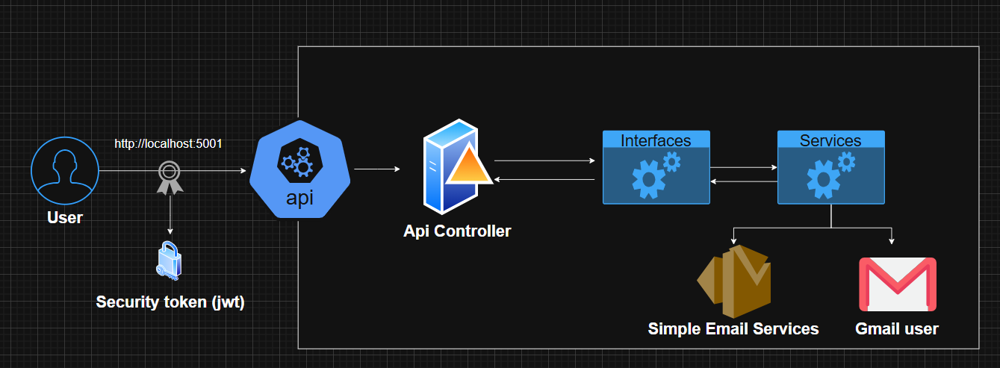

## Template.Api.Net9
This repository will contain an API with two endpoints for sending emails containing information. One endpoint uses Gmail or Outlook credentials to send emails, while the other utilizes the AWS SDK to send messages via Amazon SES (Simple Email Service). It provides flexible options for email notifications.<br>
This is a copy of Template.Api.Net9.
This repository uses the AWS SDK, that is, it uses AWS credentials. If you have the AWS CLI installed and already have the credentials, it will work fine.

## API Reference

```http
POST /api/v1/Notification/send-ses
```

Body
```
{
  "recipientName": "string",
  "recipientEmail": "string",
  "subject": "string",
  "body": "string"
}
```

```http
POST /api/v1/Notification/send-smpt
```

Body
```
{
  "recipientName": "string",
  "recipientEmail": "string",
  "subject": "string",
  "body": "string"
}
```

### Api Diagram


### Authorization
It implements JWT authentication to secure endpoints, validating issuer, audience, and signature, allowing access only to authorized users.
```
[Authorize(AuthenticationSchemes = "Auth0App1")]
[Authorize(AuthenticationSchemes = "Auth0App2")]
```
Environment variables setting (auth0 in this case)
```
  "Auth0App1": {
    "Issuer": "https://test.asdasdasd.auth0/",
    "Audience": "Test-Api"
  },
  "Auth0App2": {
    "Issuer": "AgusFassina",
    "Audience": "Agusfassina"
  }
```

## Dotnet build and run
```
dotnet build
dotnet run
```

## Docker build and run

```
# Docker build
docker build -f Dockerfile -t api .
# Docker run in the port 8787
docker run -d -p 8787:80 -e "ASPNETCORE_ENVIRONMENT=Development" --name api api
# api tests http://localhost:8787/swagger/index.html
```


