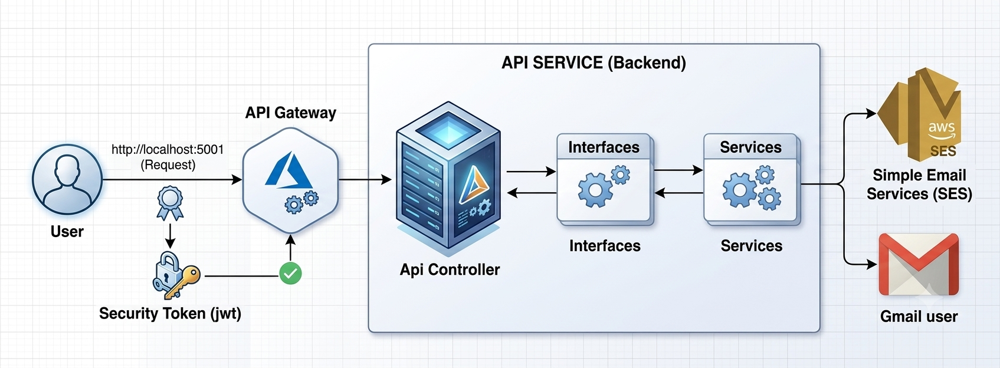

# 📬 Notification API (.NET 10)
REST API for sending email notifications using two providers:

- SMTP (Gmail/Outlook credentials)
- AWS SES (via AWS SDK)

This project is based on `Template.Api.Net9`.

## ✨ Features
- Send transactional emails using AWS SES
- Send emails using SMTP credentials
- JWT-based authentication with two configured schemes
- Swagger UI available in Development environment

## 📋 Requirements
- .NET SDK 10
- Optional: Docker
- AWS credentials configured (for SES endpoint), usually through AWS CLI or environment variables

## ⚙️ Configuration
Define the following settings in `appsettings.Development.json` (or environment variables):

```json
{
  "Auth0App1": {
    "Issuer": "https://your-tenant.auth0.com/",
    "Audience": "your-api-audience"
  },
  "Auth0App2": {
    "Issuer": "https://issuer.example.com/",
    "Audience": "your-second-audience"
  },
  "SMTPSetting": {
    "Port": 587,
    "Host": "smtp-mail.outlook.com",
    "Email": "your-email@domain.com",
    "Password": "your-password",
    "Name": "Notification API"
  },
  "AWSSetting": {
    "Region": "us-west-1",
    "EmailFrom": "verified-sender@domain.com"
  }
}
```

### 🔐 Auth
The API validates issuer and audience using JWT bearer authentication schemes:

```csharp
[Authorize(AuthenticationSchemes = "Auth0App1")]
[Authorize(AuthenticationSchemes = "Auth0App2")]
```

## 📚 API Reference
### ☁️ Send email with AWS SES
```http
POST /api/v1/Notification/send-ses
```

Body:

```json
{
  "recipientName": "string",
  "recipientEmail": "string",
  "subject": "string",
  "body": "string"
}
```

### 📨 Send email with SMTP
```http
POST /api/v1/Notification/send-smpt
```

> Note: the route is currently `send-smpt` in the controller.

Body:

```json
{
  "recipientName": "string",
  "recipientEmail": "string",
  "subject": "string",
  "body": "string"
}
```

### 🩺 Health/Version endpoint
```http
GET /api/v1/Notification/version
```

## 🚀 Run locally
```bash
dotnet restore
dotnet build
dotnet run
```

Swagger (Development): `https://localhost:<port>/swagger`

## 🐳 Run with Docker
```bash
# Build image
docker build -f Dockerfile -t notification-api .

# Run container on port 8787
docker run -d -p 8787:80 -e "ASPNETCORE_ENVIRONMENT=Development" --name notification-api notification-api
```

Swagger in Docker: `http://localhost:8787/swagger/index.html`

## 🗺️ Diagram



