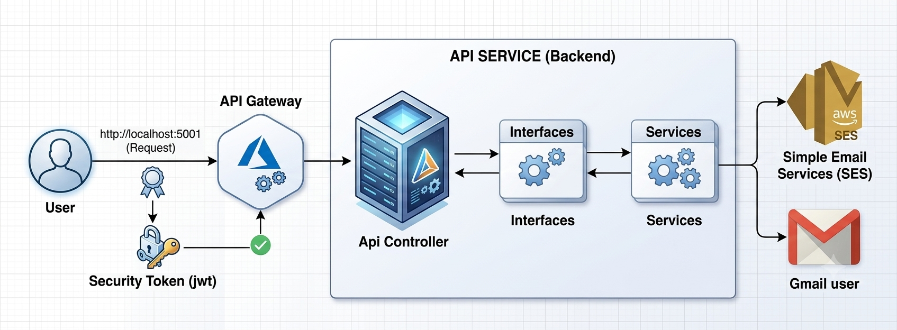

# 📬 Notification API
.NET 10 REST API that sends email notifications through AWS SES or SMTP.

## 🗺️ Architecture


## 📋 Requirements
- ✅ .NET SDK 10
- ✅ AWS credentials (for the SES endpoint), via AWS CLI or environment variables
- 🐳 Docker (optional)

## 📁 Solution structure
```text
NotificationApi.sln
├── NotificationApi.csproj          # API host
├── NotificationApi.Tests/          # xUnit + Moq unit tests
├── Controllers/                    # Notification endpoints
├── Services/                       # SES / SMTP logic and settings
├── Contracts/Request/              # API request models
├── Mappers/                        # AutoMapper profiles
├── Dockerfile
├── NotificationApi.http            # Sample HTTP requests
└── appsettings.Development.json    # Local config
```

## 🚀 Run locally
```bash
dotnet restore
dotnet run --project NotificationApi.csproj
```

- HTTP: `http://localhost:5142`
- HTTPS: `https://localhost:7137`
- Swagger (Development): `http://localhost:5142/swagger`
- Version: `GET /api/v1/Notification/version`

Sample requests: `NotificationApi.http`

### Tests
```bash
dotnet test
```

## ⚙️ Configuration
Set these sections in `appsettings.Development.json` (or environment variables). The app binds `SMTPSetting` and `AWSSetting` by those exact names:

```json
{
  "Auth0App1": {
    "Issuer": "your-issuer",
    "Audience": "your-audience"
  },
  "Auth0App2": {
    "Issuer": "your-issuer",
    "Audience": "your-audience"
  },
  "SMTPSetting": {
    "Port": 587,
    "Host": "smtp-mail.outlook.com",
    "Email": "your-email@domain.com",
    "Password": "your-password",
    "Name": "Notification API"
  },
  "AWSSetting": {
    "Region": "us-west-1",
    "EmailFrom": "verified-sender@domain.com"
  }
}
```

## 📚 Endpoints
| Method | Path | Description |
| --- | --- | --- |
| `POST` | `/api/v1/Notification/send-ses` | Send email via AWS SES |
| `POST` | `/api/v1/Notification/send-smpt` | Send email via SMTP (route spelling is `send-smpt`) |
| `GET` | `/api/v1/Notification/version` | Returns `v1.0.0` |

Email body for both send endpoints:

```json
{
  "recipientName": "string",
  "recipientEmail": "string",
  "subject": "string",
  "body": "string"
}
```

## 🐳 Docker
```bash
docker build -f Dockerfile -t notification-api .
docker run -d -p 8787:80 -e "ASPNETCORE_ENVIRONMENT=Development" --name notification-api notification-api
```

Swagger in the container: `http://localhost:8787/swagger`